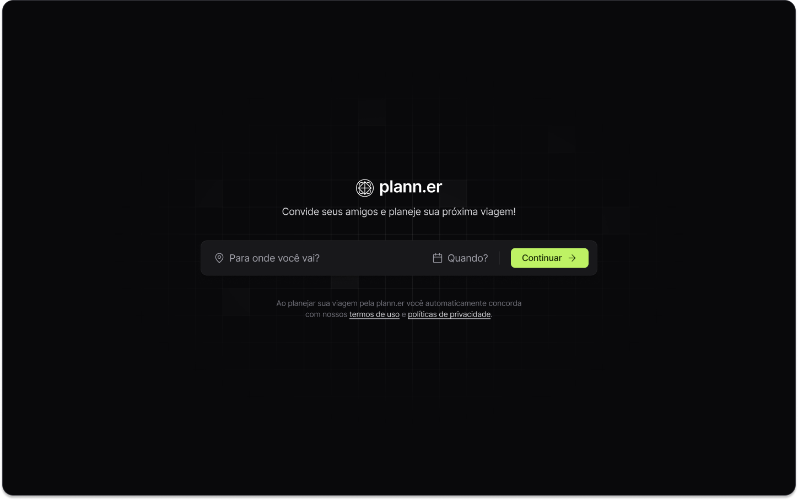

<h1 align="center">plann.er - NLW Journey - Trilha React</h1>

  <a href="#-tecnologias">Tecnologias</a>&nbsp;&nbsp;&nbsp;|&nbsp;&nbsp;&nbsp;
  <a href="#-projeto">Projeto</a>&nbsp;&nbsp;&nbsp;|&nbsp;&nbsp;&nbsp;
  <a href="#-layout">Layout</a>

 

  

## 🚀 Tecnologias

Esse projeto foi desenvolvido com as seguintes tecnologias:

- TypeScript
- React
- Tailwind
- Tailwind Variants
- Axios
- React Day Picker
- Date-fns

## 💻 Projeto

Projeto desenvolvido durante o evento NLW Journey, promovido pela Rocketseat.

⚠️ Este projeto consome a API desenvolvida pela Rocketseat, portanto, para que este projeto funcione corretamente, é necessário clonar [este repositório](https://github.com/rocketseat-education/nlw-journey-nodejs) e rodar ele localmente na sua máquina. Você pode acessa a documentação da API clicando [neste link](https://nlw-journey.apidocumentation.com/reference#tag/trips)

## 🔖 Layout

Você pode visualizar o layout do Figma [neste link](https://www.figma.com/community/file/1392276515495389646).
